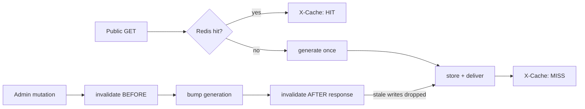

# Navatra 4K TV — System Design Document

**Version:** 1.0  
**Last updated:** 2026-08-19  
**Stack:** Vue 3 (public site + admin) · Express 5 · Prisma 5 · SQLite / MinIO / Redis · Docker Compose

---

## 1. Overview

Navatra 4K TV is a modern, full-featured Cambodian news platform. It ships **three applications** in one monorepo:

| App | Path | Port (dev) | Role |
|-----|------|-----------|------|
| `frontend` | `frontend/` | 5173 | Public bilingual website (Khmer/English) |
| `admin` | `admin/` | 5174 | Editorial CMS / backend office |
| `backend` | `backend/` | 4000 | REST API, auth, caching, media, jobs |

Everything a visitor sees — theme colors, header/footer, homepage sections, navigation, ads, ticker — is **admin-configurable in real time** with no redeploys.

```
                        ┌─────────────────────────────┐
                        │         Browser             │
                        └──────┬──────────────┬───────┘
                    public site│              │admin CMS
                               ▼              ▼
                    ┌───────────────┐  ┌────────────────┐
                    │  frontend     │  │  admin         │
                    │  Vue 3 (nginx)│  │  Vue 3 (nginx) │
                    └───────┬───────┘  └───────┬────────┘
                            │        /api/v1 (VITE_API_BASE)
                            ▼                   ▼
                    ┌─────────────────────────────────────┐
                    │  backend — Express REST API :4000    │
                    │  auth · validation · cache · jobs    │
                    └──────┬──────────┬───────────┬────────┘
                           ▼          ▼           ▼
                     ┌─────────┐  ┌────────┐  ┌──────────┐
                     │ SQLite  │  │ Redis  │  │ MinIO    │
                     │ (data)  │  │(cache) │  │ (media)  │
                     └─────────┘  └────────┘  └──────────┘
                                            (Telegram Bot API)
```

---

## 2. System Architecture

### 2.1 Runtime topology (Docker Compose)

| Service | Image / build | Exposed port | Purpose |
|---------|--------------|--------------|---------|
| `backend` | repo-root build, `backend/Dockerfile` | `4000` | Express API, Prisma, Telegram worker |
| `frontend` | `frontend/Dockerfile` (nginx) | `3000` | Public site static bundle |
| `admin` | `admin/Dockerfile` (nginx) | `3001` | CMS static bundle |
| `redis` | `redis:7-alpine` | `6379` | Public-feed cache (AOF persistence) |
| `minio` | `minio/minio:latest` | `9000` / `9001` | S3 object storage + web console |
| `mock-telegram` | `e2e/mock-telegram` (test-only) | `8448` | Fake Telegram Bot API for E2E |

Persistent volumes: `sqlite_data` (database file), `uploads_data` (local uploads fallback), `redis_data`, `minio_data`.

### 2.2 Failure isolation

- **Redis down** → API keeps serving; cache layer transparently falls back to an in-memory store (never a point of failure).
- **MinIO down** → images fall back to local `/uploads`; uploads degrade gracefully.
- **Telegram unreachable** → auto-publish jobs queue in Redis and retry with backoff (max 3 attempts); no impact on the site.
- **Database down** → `/health` reports `503`; every dependency is health-checked independently (`database`, `redis`, `minio`).

### 2.3 Concurrency model

- **In-flight dedup** — concurrent requests for the same cache key share one generation promise.
- **Generation counter** — a monotonically increasing counter guards against stale cache writes: a GET that read pre-mutation data and writes *after* a mutation invalidates its own write.
- **Targeted invalidation** — admin mutations clear *only* the public feeds they can affect, awaited **before** the mutation and re-run after the response (see §7).

---

## 3. Technology Stack

| Layer | Technology |
|-------|-----------|
| Frontend / Admin | Vue 3 (Composition API, `<script setup>`), Vue Router, Pinia, Vite |
| Editor | Tiptap (rich text, image + link extensions) |
| Icons | FontAwesome 6 + Themify (frontend), Lucide (admin) |
| Styling | Hand-written CSS with design tokens (frontend), Tailwind CSS (admin) |
| Backend | Node.js ≥18, Express, helmet, cors, zod validation |
| ORM | Prisma 5 (SQLite in dev/prod default) |
| Cache | ioredis (Redis 7) + in-memory fallback |
| Media | MinIO client + local `/uploads` fallback, Multer uploads, sharp-free resize-by-URL |
| Jobs | Worker thread polling a Redis queue (Telegram auto-publish) |
| Tests | Playwright (API + UI + security + multilingual + Telegram), ESLint, `vue-tsc` |
| Deploy | Docker Compose, nginx static hosting, multi-stage Dockerfiles |

---

## 4. Repository Structure

```
aznews-master/
├── backend/
│   ├── prisma/
│   │   ├── schema.prisma          # data model
│   │   ├── migrations/            # SQL migrations
│   │   └── seed.ts                # demo content, admin user, settings
│   └── src/
│       ├── server.ts              # bootstrap: bucket, worker, graceful shutdown
│       ├── app.ts                 # middleware stack, /health, /minio proxy
│       ├── config/env.ts          # zod-validated environment
│       ├── routes/                # public, admin, auth routers
│       ├── controllers/           # thin HTTP layer
│       ├── services/              # business logic
│       ├── validators/            # zod schemas (per-resource)
│       ├── middleware/            # auth, cache, rateLimit, validate, upload, error
│       ├── jobs/telegram.worker.ts# auto-publish worker
│       └── lib/                   # prisma, redis, minio, logger, telegram client
├── frontend/src/
│   ├── views/                     # Home, Article, Category, News, Search, Author, About, Contact
│   ├── components/                # layout / article / common / ads
│   ├── composables/               # useTheme, useSeo, useShareLinks, useLocalized
│   ├── stores/                    # settings, locale (Pinia)
│   ├── services/                  # API clients (content.service, article.service)
│   ├── styles/app.css             # design tokens + global CSS + grid system
│   ├── locales/                   # kh.ts, en.ts
│   ├── types/                     # shared TS contracts
│   └── router/                    # SPA routes
├── admin/src/
│   ├── views/                     # every CMS screen (§10)
│   ├── components/                # editor, media, ui (Modal, ConfirmDialog…)
│   ├── layouts/AdminLayout.vue    # sidebar shell
│   ├── services/admin.service.ts  # typed API client
│   └── stores/                    # auth, toast
├── e2e/                           # Playwright suites + mock-telegram
│   ├── api.spec.ts                # full API contract coverage
│   ├── frontend.spec.ts           # visitor journeys
│   ├── admin-comprehensive.spec.ts# CMS CRUD
│   ├── multilingual.spec.ts       # ticker + theme + banners
│   ├── media.spec.ts              # upload pipelines
│   ├── security.spec.ts           # authz/rate-limit/injection
│   └── telegram.spec.ts           # publish flow vs mock Bot API
└── docs/                          # this documentation
```

---

## 5. Backend Design

### 5.1 Middleware chain (order matters)

```
helmet → cors → json/urlencoded(1mb) → cookieParser
      → /uploads (static, 7d cache)
      → /minio   (S3 object proxy, immutable 1-year cache)
      → /health  (dependency probe)
      → /api/v1: apiLimiter → auth → [public | admin] routers
      → notFoundHandler → errorHandler
```

- CORS allows the frontend, admin, and any localhost:port origin; credentials enabled.
- `x-powered-by` disabled; helmet with `crossOriginResourcePolicy: cross-origin` (images are served cross-origin to both apps).

### 5.2 Authentication & authorization

- **JWT access token** (15 min default) + **refresh token** (7 days, rotate on use).
- Roles: `SUPER_ADMIN` > `ADMIN` > `EDITOR` > `AUTHOR`.
- Route guards:
  - `authenticate` — every `/admin/*` call.
  - `requireEditor` — content mutations (articles, categories, tags, ads, builders…).
  - `requireAdmin` — users, settings, telegram, activity, messages, newsletter.
- Passwords hashed with bcrypt; Telegram secrets are **masked** in admin responses (dedicated endpoints manage them).

### 5.3 Validation

Every request passes a **zod** schema (`body` / `params` / `query`) via the `validate` middleware. Rules are conservative:

- Hex colors are regex-validated (`^#[0-9a-fA-F]{6}$`) — no arbitrary CSS ever reaches the frontend.
- Gallery columns `2..4`, nav columns `2..4`, homepage columns `2..6`, pagination ≤ 50.
- HTML-free share template strings ≤ 500 chars; `{url}` / `{title}` placeholders only.
- Bulk actions capped (200 articles), newsletter/tag/comment lengths bounded.

### 5.4 Public API (`/api/v1`)

| Method | Route | Notes |
|--------|-------|-------|
| GET | `/settings` | site meta + theme tokens + share templates (one payload) |
| GET | `/categories`, `/tags` | nested CategoryTag/tags data |
| GET | `/homepage/sections` | enabled builder sections with layout `config` |
| GET | `/navigation` | nav items with per-item layout `config` |
| GET | `/ticker` | live-news settings + newest published articles |
| GET | `/ads/:position` | priority/device/schedule-filtered advertisement |
| GET | `/articles` | paginated, filterable (`category`, `tag`, `q`, `featured`, `breaking`, `sort`, `authorId`) |
| GET | `/articles/breaking` · `/featured` · `/latest` · `/popular` | curated feeds |
| GET | `/articles/:slug` | detail (view counter dedupe, see §11) |
| GET | `/articles/:slug/related` | same-category related |
| GET | `/categories/:slug/articles` · `/authors/:id/articles` | listings |
| GET | `/sitemap.xml` · `/robots.txt` | SEO |
| POST | `/comments` · `/contact` · `/newsletter` | public submissions (always hit DB) |

### 5.5 Admin API (`/api/v1/admin`)

| Area | Routes |
|------|--------|
| System | `GET/PUT /settings`, `GET /stats`, `GET /activity` |
| Homepage builder | `GET/PUT /homepage/sections`, `POST /homepage/sections/reorder` |
| Navigation builder | CRUD `/navigation` (+ `POST /reorder`) |
| Articles | CRUD `/articles`, `POST /articles/bulk`, gallery `GET/POST /articles/:id/images`, `PATCH/DELETE /articles/:id/images/:imageId` |
| Content | Categories, Tags, Ads (CRUD + reorder) |
| Media | `GET /media`, `POST /media/upload`, `POST /media/bulk`, `DELETE /media/:id` |
| Users | CRUD `/users` (admin only) |
| Moderation | Comments, contact messages, newsletter subscribers |
| Telegram | `GET/PUT /settings/telegram`, `POST …/test`, `POST …/discover`, `GET /telegram/stats`, `GET …/articles/:id/telegram`, `POST …/telegram/send` |

---

## 6. Database Design

SQLite via Prisma with migrations. Key entities:

```
User 1──* Article 1──* ArticleImage *──1 Media
Article *──* Tag (join: ArticleTag)
Category 1──* Article
Article 1──* Comment      Article 1──* ViewLog
Article 1──* TelegramPublication
SiteSettings (singleton)
HomepageSection (singleton per key)   NavigationItem
Media (MinIO/local)  Advertisement  NewsletterSubscriber  ContactMessage  ActivityLog
```

| Model | Purpose | Notable fields |
|-------|---------|----------------|
| `User` | staff accounts | role, avatar, isActive, refreshToken |
| `Article` | content | kh+en title/excerpt/content, slug, status (`DRAFT/PUBLISHED/SCHEDULED/ARCHIVED`), featuredImage, `galleryColumns` (2–4), isFeatured, isBreaking, views, publishedAt |
| `ArticleImage` | gallery rows | mediaId, altText, caption, sortOrder; `@@unique(articleId, mediaId)` |
| `Media` | uploads | objectKey, url/secureUrl, dimensions, mimeType |
| `Category` | sections | kh+en name, slug, description, color, sortOrder |
| `Tag` | labels | slug, usageCount |
| `Comment` | reader comments | status (`PENDING/APPROVED/REJECTED`) |
| `ViewLog` | per-view time series | powers the dashboard views-over-time chart |
| `Advertisement` | banner ads | position, image, link/target, device, priority, start/endAt, active |
| `TickerSettings`* | live-news bar | enable, title, speed, direction, count, refresh, colors (*stored on `SiteSettings` first singleton row) |
| `SiteSettings` | platform config | branding, social, contact, ticker, **theme tokens**, **layout zones**, **share templates**, fonts, SEO |
| `HomepageSection` | homepage builder | key (`breaking|hero|weekly|whats-new|latest|video|recent`), label, enabled, sortOrder, `config` (JSON) |
| `NavigationItem` | menu builder | type (`home|category|page|link`), value, `config` (JSON layout), sortOrder, isActive |
| `ActivityLog` | audit trail | action, entity, user, ip |
| `TelegramPublication` | per-chat send state | status, messageId, attempts, nextAttemptAt |

> The single `SiteSettings` row doubles as the ticker store; ticker colors are validated hex values exposed publicly so the frontend renders the bar from cache without an extra request.

---

## 7. Caching Strategy



- **TTL:** 30s for all public feeds.
- **Keys:** `pub/api/v1/...` prefixes (per-feed, so one clear never nukes unrelated content).
- **Generation guard:** every write captures the generation at request start; a mutation bumps the generation so in-flight stale writes self-destruct.
- **Targeted invalidation map:** articles → list/popular/latest + affected detail/related/category feeds + ticker + sitemap; categories → category feeds + embedded article payloads; settings → settings + ticker; homepage → homepage sections; navigation → nav; ads → ads; users → article payloads (author name embedded).
- **Fallback:** when Redis is unreachable, an in-memory TTL store is used transparently.

---

## 8. Frontend — Public Website

### 8.1 Design token system (`useTheme.ts` + `styles/app.css`)

The admin theme is applied as CSS custom properties on `:root`, from **one cached `/settings` payload**:

- **Brand tokens:** `--color-primary/-secondary/-accent`, surface/text/muted/border, plus computed `--color-primary-contrast` (auto white/dark by luminance).
- **Layout zones:** `--color-header-bg/-text`, `--color-footer-bg/-text` (+ blended muted/border), `--color-bg` (page background).
- **Typography:** heading/body/article font families + 4 size tokens (`--size-hero/-section/-card/-body`).
- **Corners & shadows:** `radiusPreset` (`sharp|minimal|medium|rounded`) → `--radius-*`; `shadowPreset` (`none|subtle|medium|strong`) → `--shadow-*`.
- **Flat mode:** default `radiusPreset=sharp` + `shadowPreset=none` sets `data-flat="true"` on the root; a global `[data-flat] *` rule forces `border-radius:0/box-shadow:none` across the entire site (admin can opt back into rounded/styled).
- **Layout width:** `layoutStyle` (`boxed` 1240px / `wide` 1440px / `fluid` 100%) drives `--container-max`.
- **Category palette:** `--cat-national/-political/-international/-business/-technology/-sports/-entertainment` — every news card and chip draws its color from the category id, never hardcoded per item.

### 8.2 Header (SiteHeader.vue)

- **Row 1 – Utility:** current date (Khmer digits), social links, language switcher (kh/en persisted).
- **Row 2 – Brand:** logo on the **left**, admin-managed **header ad slot** on the right, hamburger on the right (mobile).
- **Row 3 – Navbar:** **Home first, then categories**, each separated by a single vertical line; a 7th-slot **"More" hover dropdown** collects any overflow admin items (one clean column, accent top-border, sticky variant). Scroll > 130px pins a compact bar with the **logo left + items right** in dark `#0b1c39`.
- **Search:** desktop icon slides a full-width search bar that routes to `/search?q=`; the mobile drawer has its own search + menu.

### 8.3 Homepage layout system (HomeView + builder)

Sections are driven by `HomepageSection` rows the admin can enable/reorder/configure:

| Section | Renders | Admin config |
|---------|---------|--------------|
| `hero` | **3-column grid**: left “ពិសេស” rail (2 image cards) · center big story (`960px` image + title/excerpt/meta + 3 smaller cards) · right “ព័ត៌មានថ្មីៗ” list | `sidebar` (right rail), `left` (left rail) |
| `weekly` | 5-card grid from featured extras | `columns` 2–6 |
| `whats-new` | Popular grid (`០១–០៥` rank cards) | `columns` 2–6 |
| `video` | YouTube-style 16:9 grid | `columns` 2–6 |
| `recent` | Latest grid | `columns` 2–6 |
| `latest` | Homepage ad slot (position `homepage-middle`) | enabled |
| `breaking` | Controls “ក្តៅ” badges on the homepage | enabled |

- **Grid system** (`app.css`): 12-column `.g-grid` utilities and a responsive `.g-cards` grid driven by `--grid-cols`, collapsing 6→3→2→1 columns across breakpoints.
- The **hero** collapses 3→2 columns at 1200px and 1 column on mobile.

### 8.4 Article detail (ArticleView)

- Sanitized HTML body (script/iframe/`on*` stripped), reading-time, Khmer dates, tag chips, user comments.
- **Gallery**: all article images in a responsive grid using `galleryColumns` (2–4, set per article in the editor); click opens a **lightbox** (arrows, keyboard ←/→/Esc, counter).
- **Floating share rail** (left, ≥1400px, appears on scroll): admin-configured Facebook/TikTok/Telegram/WhatsApp templates (`{url}`/`{title}`) + copy-link button. Text share buttons are removed for a clean look.
- **SEO**: OpenGraph/Twitter tags and JSON-LD (`NewsArticle`, `BreadcrumbList`) from `useSeo`.

### 8.5 Listing pages

- **One-row items** (`NewsRowCard`): image left, text right, single black line under each — used on News, Latest, Category, Search, Author.
- **Per-page layout from the navbar config**: a nav item with `config.layout=grid` renders its category/news page as a card grid (2/3/4 columns); the default is the clean list.
- **Sidebars**: `SidebarPopular` (“ព័ត៌មានពេញនិយម”) with small image left + text right rows, and popular articles; category/author/search pages include ad slots.

### 8.6 Multilingual & SEO

- Khmer/English labels everywhere (`kh.ts`/`en.ts`); the URL language (`/kh/news/:slug`, `/en/news/:slug`) beats the stored preference (used by Telegram deep links).
- Sitemap + robots generated server-side; per-view JSON-LD on articles and collection pages.

---

## 9. Media pipeline

1. Admin uploads via **Multer** (`POST /admin/media/upload`, `1mb` cap).
2. Files are pushed to **MinIO** (`news-media` bucket) with signed-ish public URLs served through the **`/minio` proxy** (immutable 1-year `Cache-Control`).
3. If MinIO is unavailable, files land in `/uploads` (7-day browser cache) — the same UI keeps working.
4. Uploaded media feeds the **featured image picker** and the **gallery multi-select** (add several gallery images at once, reorder, alt/caption per image).
5. On media delete, both storage backends are cleaned up.

---

## 10. Admin CMS

| Screen | Features |
|--------|----------|
| **Dashboard** | stats cards, views-over-time chart (from `ViewLog`), recent activity |
| **Articles** | list w/ filters+bulk actions (publish/unpublish/delete), bilingual editor (Tiptap), featured image, gallery manager with **Grid columns selector**, tags, schedule, Telegram send panel |
| **Categories / Tags** | multilingual CRUD, drag-reorder, colors |
| **Media** | library, upload, bulk delete |
| **Users** | role-based admin, activity |
| **Comments / Messages / Newsletter** | moderation queues, delete |
| **Ads** | position/device/priority/schedule banner management |
| **Live News** | ticker on/off, speed, direction, count, colors |
| **Homepage builder** | per-section enable/reorder + **grid-column & sidebar/left-rail editors with live preview** |
| **Navigation builder** | add/edit/reorder menu items + **per-item Grid/List layout editor with preview** |
| **Settings** | general, social, **share-link templates**, fonts, sizes, **zone colors (navbar/body/footer)**, layout style, radius/shadow presets + **live mini-site preview** |
| **Telegram** | token/chat management (masked), channel discovery, test, stats |
| **Activity** | full audit log |
| **Profile** | own account |

---

## 11. Data flows — notable behaviors

### 11.1 View counting
`GET /articles/:slug` increments `Article.views` and writes a `ViewLog` row, deduplicated per IP/user-agent + slug within a window (bot UA strings ignored). The counter stays the source of truth; `ViewLog` adds the time dimension for the dashboard chart.

### 11.2 Telegram auto-publish
1. Article saved with Telegram destinations; worker consumes the Redis queue.
2. Per destination: sends photo (featured image) + bilingual buttons (`/kh/news/:slug`, `/en/news/:slug`).
3. Status tracked on `TelegramPublication` (`PENDING → PROCESSING → PUBLISHED/FAILED`), retries with exponential backoff (max 3), admin UI shows per-chat status, message IDs and “open in Telegram” links, plus manual re-send.

### 11.3 Theme preview in admin
The Settings appearance tab renders a **mini site mockup** (navbar, headline, cards, buttons, footer) bound live to the form — headers/footers/body colors, radius/shadow presets, and layout width (`boxed/wide/fluid`) are all visible before saving.

---

## 12. Testing strategy (Playwright)

| Suite | Covers |
|-------|--------|
| `api.spec.ts` | full public + admin API contract, pagination shapes, cache headers (HIT/MISS), deletes, validation 400s |
| `security.spec.ts` | authz (editor vs admin), rate limiting, JWT rejection, IDOR, XSS payloads in comments/contact |
| `frontend.spec.ts` | visitor journeys: homepage sections, category pages, article detail, search, about/contact, 404 |
| `multilingual.spec.ts` | kh/en switch, ticker enable/theme, banner CRUD |
| `media.spec.ts` | upload → MinIO proxy → media library → featured/gallery selection |
| `admin-comprehensive.spec.ts` | full CMS CRUD incl. homepage + navigation builders |
| `telegram.spec.ts` | publish envelope against the in-stack `mock-telegram`, retries, message ids |

Local gate: `npm run lint` (all three apps) + `npm run typecheck -w backend` + `npm run build` (vue-tsc + vite for frontend & admin) + `npm run test:e2e`.

---

## 13. Deployment

```bash
# one command brings up backend + frontend + admin + redis + minio
docker compose up -d --build
```

- nginx serves each SPA and proxies `/api/v1` to the backend by default (`VITE_API_BASE=/api/v1`).
- Environment is **zod-validated** at boot (`backend/src/config/env.ts`): `JWT_SECRET`, `DATABASE_URL`, `REDIS_URL`, `MINIO_*`, `FRONTEND_URL`, `ADMIN_URL`, `PUBLIC_SITE_URL`.
- Migrations run from the image (the SQLite volume mounts only the data directory, never `prisma/`), then `prisma:seed` on first boot.
- Graceful shutdown: SIGINT/SIGTERM pause the Telegram worker, close the HTTP server, disconnect Prisma, and force-exit after 10s.

---

## 14. Security posture

- Helmet headers; CORS allow-list; `1mb` body cap; per-IP rate limit on `/api/v1`.
- JWT access + rotating refresh cookies; bcrypt password hashing; route-level RBAC; Telegram secrets masked and never exposed.
- Strict zod validation on all inputs (enums over free strings, hex-color regex, bounded pagination).
- Content sanitized on render (scripts/iframes/event handlers stripped server-tagged HTML).
- Cache-generation guard prevents serving stale data after mutations.
- Audit log records every sensitive admin mutation with actor + IP.